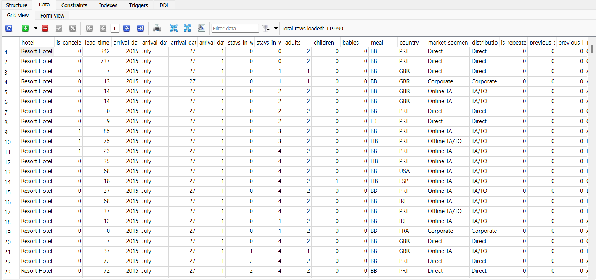

```{r setup, include=FALSE}
knitr::opts_chunk$set(echo = TRUE)
```

# City vs. Resort Hotel Bookings

### Introduction

The purpose of this exploratory data analysis project is to analyze [this hotel booking data set](https://www.sciencedirect.com/science/article/pii/S2352340918315191#section-cited-by) and provide recommendations to the hotel management team on how they can improve their marketing activities and booking process to ensure that they attract more customers and reduce their number of cancellations.

Before getting started, it is essential to know a the following about the data set:

-   The data set contains real, anonymized booking data for 2 hotels (H1and H2) located in Portugal from July 1, 2015 to August 31, 2017 where H1 is a resort hotel and H2 is a city hotel

-   There are 40,060 observations for H1 and 79,330 observations for H2 where each observation is one hotel booking

-   The data set contains 32 variables/columns however the most significant variables affecting promotional activities include:

    -   *Lead Time:* The number of days between booking date and arrival date

    -   *Market Segment:* Market segment designation for bookings

    -   *Distribution Channel:* Booking Distribution channel (e.g., Travel Agents, Direct)

    -   *Customer Type:* Type of booking (e.g., Contract, Transient)

    -   *ADR:* Average Daily Rate as defined by dividing the sum of all lodging transactions by the total number of staying nights

    -   *Reservation Status:* Date of last status change for booking (e.g., booking cancelled, checked-out)

Other variables such as the length of stay and occupants (adults and children) were also compared against one another.

### Method

To conduct an in-depth analysis on this data set, I will first consolidate and clean the data in SQLite. The cleaning process includes replacing/removing `NULL` values, renaming columns for better understanding, and deleting entries where critical information such as `hotel` is missing.

Now that the data is cleaned, the data set (renamed as HOD for 'hotel original data'), is ready for data analysis.



For this study, we will answer the following questions on the data-set:

1.  **What is the busiest/least busiest month for the hotels?**
2.  **What is the customer/market segment distribution for the hotels?**
3.  **What are the most common booking distribution channels for these hotels?**
4.  **How does the lead time differ among hotel visitors with and without children? How does the length of stay differ?**
5.  **What can hotel management do to reduce their cancellation rate?**

Through the use of SQL, Power BI, and R, we can find the answers to these questions along with other insights that may not be obvious from an initial glance at the data.

### Analysis

The first few questions of our study can be answered by performing SQL queries and aggregations. Answering the first question:

1.  **What is the busiest/least busiest month for the hotels?**

For the Resort Hotel as shown below, August is the busiest month for bookings and next is July. For resort hotels, generally the peak season is during the mid-summer months so this finding supports this inference. The least busiest month for bookings is December.

```{r echo=FALSE}
library (RSQLite)
library(DBI)
hotel_con <- dbConnect(SQLite(), 
"/Users/Nicol/OneDrive/Desktop/Projects/hotel SQL database file.db")
```

```{sql connection=hotel_con, eval=FALSE}
--determining the monthly booking distribution for the resort hotel
SELECT arrival_date_month AS Arrival_Month,
       COUNT(arrival_date_month) AS Total_Bookings
  FROM HOD
 WHERE hotel = 'Resort Hotel'
 GROUP BY arrival_date_month
 ORDER BY COUNT(arrival_date_month) DESC

```

| Arrival_Month | Total_Bookings |
|:--------------|:--------------:|
| August        |      4894      |
| July          |      4573      |
| April         |      3609      |
| May           |      3559      |
| October       |      3555      |
| March         |      3336      |
| September     |      3108      |
| February      |      3103      |
| June          |      3045      |
| December      |      2648      |
| November      |      2437      |
| January       |      2193      |

: Monthly booking distribution for Resort Hotel 2015-2017

Similarly, the City Hotel has its peak booking season in August with its least popular booking period in January.

```{sql connection=hotel_con, eval=FALSE, echo=FALSE}

SELECT arrival_date_month AS Arrival_Month,
       COUNT(arrival_date_month) AS Total_Bookings
FROM HOD
 WHERE hotel = 'City Hotel'
 GROUP BY arrival_date_month
 ORDER BY COUNT(arrival_date_month) DESC

```

| Arrival_Month | Total_Bookings |
|---------------|:--------------:|
| August        |      8983      |
| May           |      8232      |
| July          |      8088      |
| June          |      7894      |
| October       |      7605      |
| April         |      7480      |
| September     |      7400      |
| March         |      6458      |
| February      |      4965      |
| November      |      4357      |
| December      |      4132      |
| January       |      3736      |

: Monthly Booking Distribution for City Hotel 2015-2017

Moving onto the next focus point for our analysis, it is important to have a deep understanding of the customer/market segment distribution for both hotels to determine which customer audiences need to be targeted in promotions/campaigns to boost their booking frequency.

2.  **What is the customer/market segment distribution for the hotels?**

As shown in the screenshots below taken from Power BI, the customer segment distribution for the Resort Hotel and City Hotel are roughly the same with Online Travel Agents being the most popular market segment responsible for bookings. Next, the most common type of customer is Transient customers meaning they are not booking a reservation for a specific purpose such as a corporate event.


3.  **What are the most common booking distribution channels for these hotels?**

Again, if we take a look at the two photos captured from the Power BI reports above, we notice that the most common booking channels are Travel Agents/Tour Operators at these hotels.

4.  **How does the lead time differ among hotel visitors with and without children? How does the length of stay differ?**

It is no surprise to wonder whether factors such as length of stay and lead time differ based on the number of children present for the hotel booking. To answer this question, we can refer to the following:

```{r message=FALSE}
#installing ggplot2 to create graphics for this analysis
install.packages("ggplot2", repos = "http://cran.us.r-project.org")
library(ggplot2)
setwd("C:/Users/Nicol/OneDrive/Documents/")
hotel_data <- read.csv("SQLite_CSV_final_for_Rstudio.csv")

#searching for correlation between number of children and lead time for the Resort and City hotels
ggplot(data = hotel_data) + 
  geom_point(aes(x = children, y = lead_time, col = hotel)) +
  ggtitle("Lead Time versus Number of Children By Hotel Type")
```

Based on the graph above, it is apparent that guests with more children tend to book their hotel reservations closer to the day of arrival compared to those without children. In other words, more kids in a booking generally leads to a shorter booking lead time.

```{r}
#creating scatter plot to compare length of stay and number of children
ggplot(data = hotel_data) + 
  geom_point(aes(x = children, y = stays_in_weekend_nights+stays_in_week_nights, col = hotel)) + xlab("Children") + ylab("Length of Stay (Days)") +
  ggtitle("Length of Stay versus Number of Children By Hotel Type")
```

Looking at the graph above, it can be seen that generally as the number of children for a booking increases, the length of stay decreases. This is effective in useful for hotels to forecast the length of stay for customers based on the reservation size (i.e. number of adults/children) to maximize room occupancy and profit.

5.  **What can hotel management do to reduce their cancellation rate?**

To explore the last analysis question for this study, we will need to investigate if customers with a previous history of cancelling were more likely to cancel their upcoming booking. Next, we will conduct a market segment breakdown for cancellations to see which market segment is more likely to cancel their booking.

Lastly, a frequency distribution to display the number of cancellations over time will be displayed. This last point can help hotels determine when to send out booking reminder emails or special discounts to those that fit the profile of customers likely to cancel.

```{r echo=FALSE}
#creating scatter plot to determine behaviour of customers who cancel often
ggplot(data = hotel_data) + 
  geom_point(aes(x = previous_cancellations, y = reservation_status)) + xlab("Number of previous cancellations") + ylab("Reservation Status") +
  ggtitle("Previous Cancellations versus Reservation Status")
```

This graph above shows that those with a history of cancellations were often cancelling their current bookings. Since those with a higher rate of cancellations are more likely to cancel again, hotels should send those customers more frequent booking reminders prior to their arrival date and gain feedback from those who cancelled several times (over 10 times) to understand their reasons for cancelling.

```{r echo=FALSE}
#creating bar chart to view cancellation numbers by market segment
ggplot(data = hotel_data, aes(x = is_canceled+previous_cancellations, y = market_segment, fill= hotel)) + 
  geom_bar(stat="identity") + xlab("Number of Cancellations") + ylab("Market Segment") +
  ggtitle("Cancellations By Market Segment and Hotel")
```

This graphs shows that for both the City and Resort hotels, the Online Travel Agent segment is more likely to cancel hotel reservations along with the Groups segments.

Lastly, we will examine the most common times for cancellations for each hotel. By strategically sending out reminder or even special offer emails to customers during these weeks, hotels can attain higher customer retention rates. Examples of special offers can be vouchers for a discounted or free meal for the first night or for first-time customers.

```{r}
#graphing cancellation numbers distribution over weeks
ggplot(data = hotel_data, aes(x=arrival_date_week_number, y=is_canceled))+
  geom_bar(stat="identity")+
  coord_cartesian(xlim = c(0,52))+
  ggtitle("Distribution of Cancellations by Week")+
  xlab("Week Number")+
  ylab("Number of Cancellations")
```

By further examining this data in SQLite, the top five weeks for high cancellation rates at both hotels are:

```{sql connection=hotel_con}
--determining top five weeks for cancellations
SELECT DISTINCT arrival_date_week_number AS Week_Number,
                COUNT( * ) AS Total_Cancellations
  FROM HOD
 WHERE is_canceled = 1
 GROUP BY Week_Number
 ORDER BY Total_Cancellations DESC
 LIMIT 5
```

These 5 weeks have the highest overall rates of cancellations among customers. Given that both hotels are situated in Portugal, both the season and presence of national holidays can affect cancellation rates as well. For instance, Week 33 has the highest number of cancellations and is also the week of a major Portuguese national holiday, Assumption Day.

### Conclusion

After completing the EDA process using SQLite, R, and Power BI, the following main conclusions can be made about the hotel data-set:

-   The busiest time for the Resort and City hotels are the month of August while the least busiest time is January

-   Guests with more children tend to book their reservations later than those without children

-   The length of stay for customers with children is less than the length of stay for those without children

-   Customers with a history of cancellations are more likely to cancel their future reservations at both hotels

-   The 'Online TA' market segment is responsible for most of the booking cancellations for both hotels

-   Week 33 has the highest overall cancellation rate for both hotels and this may be because of significant national holidays in Portugal during this week

These findings can help the Resort and City hotel management curate their booking process to customers that are most likely to cancel and schedule any pricing discounts or offers during weeks/months with higher cancellation rates.

The Power BI visualization can be explored to determine further findings on the data-set and compare the hotels on several factors.

To improve accessibility to the Power BI reports, a PDF has been uploaded onto GitHub as well.
